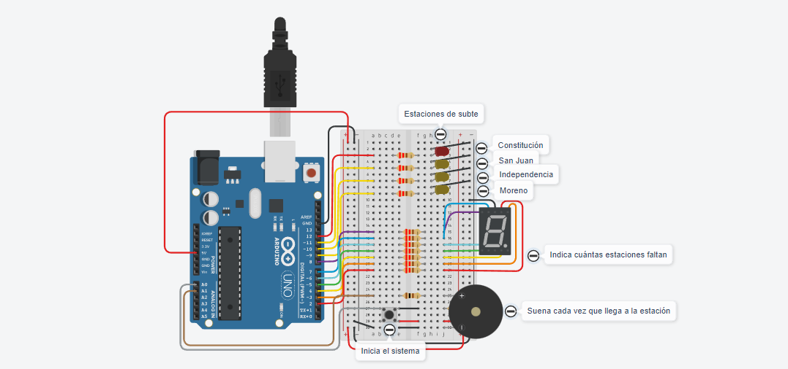

# Dojo N°2 Subte Segunda Entrega

## Integrantes 
- Spatola Mateo
- Videla Ribodino Ivan Agustín
- Manzanares Patricio
- Quiroga Joaquin
- Santa Eulalia Matias

## Proyecto: Subte.

## Descripción
Este es el código correspondiente al Dojo 2 del Grupo C. En este código se utiliza un Arduino para controlar la iluminación de cuatro LEDs (Rojo, Amarillo) un pulsador, un display siete segmentos y se le agrega un buzzer.

Consignas:
La empresa “UTN FRA Robotics” ganó la licitación de un proyecto, y deberá
Implementar un sistema que permita al usuario saber a qué estación de subte está
llegando, aparte el sistema muestra las estaciones que faltan hasta llegar a destino,
para ello debemos utilizar 4 LEDs y el display de 7 segmentos. Esta vez el buzzer
deberá emitir un sonido diferente cada vez que se llegue a una estación.
El sistema deberá arrancar apagado, luego de presionar el botón empezará y hará lo
pedido.

2 - Parte Dos: sistema completo con el buzzer.

## Función principal
El código hace uso de varias funciones para controlar el display siete segmentos, las leds, el pulsador y ahora la bocina. La función encenderApagarLedsSieteSegmentos se encarga de dividir cada segmento del display y poder prender o apagar cada uno en una misma función, pudiendo formar así diferentes números en el visualizador, haciendo además un delay de por cuanto tiempo mantenerlo prendido o apagado.

~~~ C (lenguaje en el que esta escrito)
void encenderApagarLedsSieteSegmentos(int a, int b, int c, int d, int e, int f, int g, int tiempo)
{
  digitalWrite(LED_A, a);
  digitalWrite(LED_B, b);
  digitalWrite(LED_C, c);
  digitalWrite(LED_D, d);
  digitalWrite(LED_E, e);
  digitalWrite(LED_F, f);
  digitalWrite(LED_G, g);
  delay(tiempo);
}
~~~

Las funciones prenderLed y Apagar Led, sirven para como su nombre indica apagar o prender cualquier led.

~~~ C (lenguaje en el que esta escrito)
void prenderLed(int led)
{
  digitalWrite(led, HIGH);
}

void apagarLed(int led)
{
  digitalWrite(led, LOW);
}

~~~

La función esperarInicio hace que mientras el boton no este presionado, es decir no reciba corriente eléctrica el programa se mantenga apagado, una vez se pulsa y recibe corriente ya se activa el programa.

~~~ C (lenguaje en el que esta escrito)
void esperarInicio(int pulsador)
{
  int estadoPulsador = digitalRead(pulsador);
  
  if(banderaProgramaIniciado == false)
  {
      while(estadoPulsador == LOW) 
      {
        Serial.println("Presione el pulsador para iniciar: Esperando inicio...");
        delay(500);
        estadoPulsador = digitalRead(pulsador);
      }
    banderaProgramaIniciado = true;  
  }
}
~~~

Se agregan dos funciones, las de prenderBuzzer y apagarBuzzer que como sus nombres lo indican prende y apaga la bocina y reciben como parametro el tono del ruido de la bocina

~~~ C (lenguaje en el que esta escrito)

void prenderBuzzer(int ruidoBuzzer)
{
  Serial.println("Prendo buzzer");
  tone(BUZZER,ruidoBuzzer);
}

void apagarBuzzer()
{
  Serial.println("Apago buzzer");
  noTone(BUZZER);
}

~~~

En el loop principal del código, el programa no se inicia hasta que el pulsador este activado, luego se enciende la primera led roja, suena la bocina y enciende el display siete segmentos con un 3, que son las estaciones restantes para Moreno, mantiene prendido por un lapso de 1 segundo y un cuarto y apaga el display, apaga la bocina y apaga la led, luego se enciende la primera led amarilla, suena la bocina y enciende el display siete segmentos con un 2, que son las estaciones restantes para Moreno, asi hasta llegar a la estación final.

~~~ C (lenguaje en el que esta escrito)

void loop()
{
  esperarInicio(PULSADOR);
    
  Serial.println("ESTACION CONSTITUCION - 3 para Moreno: ");
  prenderLed(LED_PRIMERO);
  prenderBuzzer(75);
  encenderApagarLedsSieteSegmentos(1,1,1,1,0,0,1,1250);
  apagarBuzzer();
  apagarLed(LED_PRIMERO);
  encenderApagarLedsSieteSegmentos(0,0,0,0,0,0,0,500);

  Serial.println("ESTACION SAN JUAN - 2 para Moreno: ");
  prenderLed(LED_SEGUNDO);
  prenderBuzzer(50);
  encenderApagarLedsSieteSegmentos(1,1,0,1,1,0,1,1250);
  apagarBuzzer();
  apagarLed(LED_SEGUNDO);
  encenderApagarLedsSieteSegmentos(0,0,0,0,0,0,0,500);

  Serial.println("ESTACION INDEPENDENCIA - 1 para Moreno: ");
  prenderLed(LED_TERCERO);
  prenderBuzzer(25);
  encenderApagarLedsSieteSegmentos(0,1,1,0,0,0,0,1250);
  apagarBuzzer();
  apagarLed(LED_TERCERO);
  encenderApagarLedsSieteSegmentos(0,0,0,0,0,0,0,500);

  Serial.println("ESTACION MORENO - 0 para Moreno: ");
  prenderLed(LED_CUARTO);
  prenderBuzzer(10);
  encenderApagarLedsSieteSegmentos(1,1,1,1,1,1,0,1250);
  apagarBuzzer();
  apagarLed(LED_CUARTO);
  encenderApagarLedsSieteSegmentos(0,0,0,0,0,0,0,500);
}

~~~

## :robot: Link al proyecto
- [Proyecto](https://www.tinkercad.com/things/b2D4mSVFazs-dojo-numero-dos-2da-parte-grupo-c-videla-ribodino-div-d)

> Recomendación: Al iniciar simulación bajar volumen
