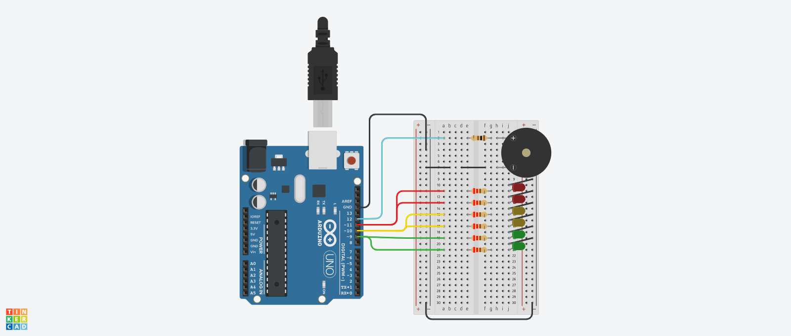

# Dojo N°1 Semaforo Primera Entrega

## Integrantes 
- Spatola Mateo
- Videla Ribodino Ivan Agustín
- Manzanares Patricio
- Quiroga Joaquin
- Santa Eulalia Matias

## Proyecto: Semaforo.

## Descripción
Este es el código correspondiente al Dojo 1 del Grupo C. En este código se utiliza un Arduino para controlar la iluminación de seis LEDs (Rojo, Amarillo y Verde) y un timbre. El objetivo del Dojo fue familiarizarse con la programación en Arduino y la interacción con componentes electrónicos.

Consignas Primera Entrega: 

- El semáforo tiene que tener 2 leds de cada color como mínimo, en caso de que uno se  rompa. 
- Tiene que implementar los tiempos correctos como se detallan a continuación. 3- El verde dura 5 segundos. 
- El amarillo dura 3 segundos. 
- Rojo dura 5 segundos. 
- Tiene que tener señalización para personas no videntes como se detalla a  continuación. (Buzzer o piezo)
- Durante el rojo: Tiene que sonar 2 vez por segundo en un tono FUERTE. 

## Función principal
El código hace uso de varias funciones para controlar los LEDs y el timbre. La función prenderApagarLedConSonido se encarga de encender el LED Rojo y prender y apagar un timbre dos veces por segundo con sonido, mientras que la funcion prenderApagarLedSinSonido se encarga de encender y apagar el resto de los LEDs con un delay especificado.

~~~ C (lenguaje en el que esta escrito)
void prenderApagarLedConSonido(int led, int tiempo)
{
  Serial.println("Prendo el led con sonido");
  for(int i = 0; i < tiempo; i += 1000)
  {
    digitalWrite(led, HIGH);
	prenderApagarBuzzer(250);
   	prenderApagarBuzzer(250);
  }
  digitalWrite(led,LOW);
}
~~~

~~~ C (lenguaje en el que esta escrito)
void prenderApagarLedSinSonido(int led, int tiempo)
{
  
  Serial.println("Prendo el led sin sonido");
  digitalWrite(led, HIGH);
  delay(tiempo);
  digitalWrite(led, LOW);
}
~~~

La función prenderApagarBuzzer hace sonar el timbre dos veces en un lapso de 1000ms.

~~~ C (lenguaje en el que esta escrito)
void prenderApagarBuzzer(int tiempo)
{
  Serial.println("Prendo buzzer");
  tone(BUZZER,500);
  delay(tiempo);
  Serial.println("Apago buzzer");
  noTone(BUZZER);
  delay(tiempo);
}
~~~

En el loop principal del código, se enciende el LED Rojo y se hace sonar el timbre por 5 segundos. Luego, se enciende el LED Amarillo por 3 segundos, seguido del LED Verde por 5 segundos y finalmente, se enciende el LED Amarillo por otros 3 segundos.

## :robot: Link al proyecto
- [Proyecto](https://www.tinkercad.com/things/lz2amNl7QNL-dojo-numero-uno-primera-entrega-grupo-c-videla-ribodino-div-d)

> Recomendación: Al iniciar simulación bajar volumen