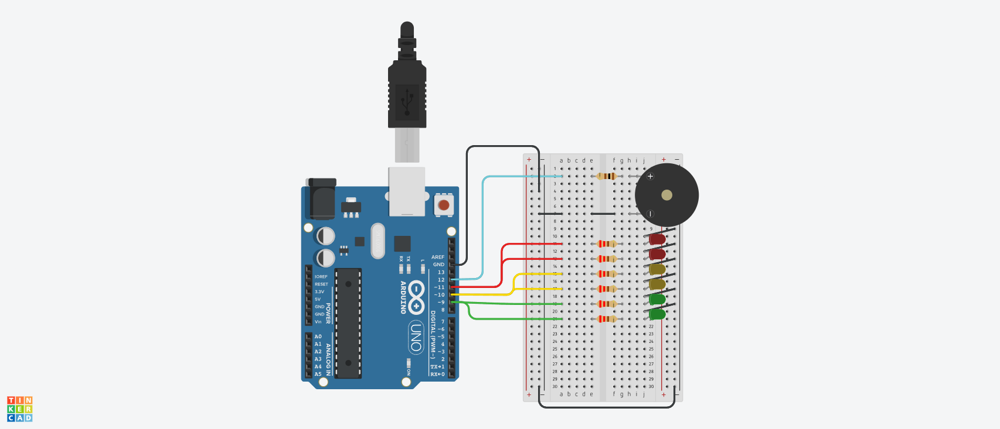

# Dojo N°1 Semaforo Segunda Entrega

## Integrantes 
- Spatola Mateo
- Videla Ribodino Ivan Agustín
- Manzanares Patricio
- Quiroga Joaquin
- Santa Eulalia Matias

## Proyecto: Semaforo.

## Descripción
Este es el código correspondiente al Dojo 1 del Grupo C. En este código se utiliza un Arduino para controlar la iluminación de seis LEDs (Rojo, Amarillo y Verde) y un timbre. El objetivo del Dojo fue familiarizarse con la programación en Arduino y la interacción con componentes electrónicos.

Consignas Segunda Entrega - nuevos requisitos:

- Durante el amarillo: Tiene que sonar 1 vez por segundo en un tono SUAVE. 
- Al cambiar de verde a amarillo debe titilar 3 veces el verde antes de pasar al amarillo
- Al cambiar de amarillo a rojo se debe titilar 3 veces el amarillo
- Al cambiar de rojo a Amarillo se debe titilar 3 veces el rojo
- Al cambiar de amarillo a verde se debe titilar 3 veces el amarillo.

## Función principal
El código hace uso de varias funciones para controlar los LEDs y el timbre. Hubo modificaciones en la función principal, prenderApagarLedConSonido, ahora además de encender el LED Rojo y prender y apagar un timbre dos veces por segundo en tono FUERTE, ahora también enciende el LED Amarillo y suena una vez por segundo en un tono SUAVE. Ahora la función prenderApagarLedSinSonido se encarga de encender y apagar el LED Verde con un delay especificado que es la única que no tiene sonido. 

~~~ C (lenguaje en el que esta escrito) 
void prenderApagarLedConSonido(int led, int tiempoLed, int tiempoSonido, int ruidoBuzzer)
{
  Serial.println("Prendo el led con sonido");
  for(int i = 0; i < tiempoLed; i += 1000)
  {
    if(led == LED_ROJO)
    {
      digitalWrite(led, HIGH);
      prenderApagarBuzzer(tiempoSonido, ruidoBuzzer);
      prenderApagarBuzzer(tiempoSonido, ruidoBuzzer);
    }
    else
    {
      if(led == LED_AMARILLO)
      {
        digitalWrite(led, HIGH);
      	prenderApagarBuzzer(tiempoSonido, ruidoBuzzer);
      }
    }
  }
  digitalWrite(led,LOW);
}
~~~

~~~ C (lenguaje en el que esta escrito)
void prenderApagarLedSinSonido(int led, int tiempoLed)
{
  
  Serial.println("Prendo el led sin sonido");
  digitalWrite(led, HIGH);
  delay(tiempoLed);
  digitalWrite(led, LOW);
}
~~~

La función prenderApagarBuzzer hace sonar el timbre una vez en un lapso del tiempo requerido.

~~~ C (lenguaje en el que esta escrito)
void prenderApagarBuzzer(int tiempoSonido, int ruidoBuzzer)
{
  Serial.println("Prendo buzzer");
  tone(BUZZER,ruidoBuzzer);
  delay(tiempoSonido);
  Serial.println("Apago buzzer");
  noTone(BUZZER);
  delay(tiempoSonido);
}

~~~

Se agrego una nueva función titilarLedColor que titila las veces que haga falta por parametro, cualquier luz por un tiempo determinado

~~~ C (lenguaje en el que esta escrito)

void titilarLedColor(int led, int tiempoLed, int cantidadTitileo)
{
  for(int i = 0; i < cantidadTitileo; i++)
  {
    delay(tiempoLed);
    prenderApagarLedSinSonido(led, tiempoLed);
    delay(tiempoLed);
  }
}
~~~

En el loop principal del código, se enciende el LED Rojo y se hace sonar el timbre por 5 segundos 10 veces en un tono FUERTE. Titila la led roja 3 veces. Luego, se enciende el LED Amarillo y se hace sonar el timbre por 3 segundos 3 veces en un tono SUAVE. Titila la led amarilla 3 veces. Luego, se enciende el LED Verde por 5 segundos. Titila la led verde 3 veces. se enciende el LED Amarillo por otros 3 segundos con el respectivo sonido. Titila la led amarilla 3 veces.

~~~ C (lenguaje en el que esta escrito)

void loop()
{
  prenderApagarLedConSonido(LED_ROJO,5000,250,500);
  titilarLedColor(LED_ROJO,250,3);
  prenderApagarLedConSonido(LED_AMARILLO,3000,500,100);
  titilarLedColor(LED_AMARILLO,250,3);
  prenderApagarLedSinSonido(LED_VERDE,5000);
  titilarLedColor(LED_VERDE,250,3);
  prenderApagarLedConSonido(LED_AMARILLO,3000,500,100);
  titilarLedColor(LED_AMARILLO,250,3);
}

~~~

## :robot: Link al proyecto
- [Proyecto](https://www.tinkercad.com/things/3sEZY8bwm1U-dojo-numero-uno-2da-parte-grupo-c-videla-ribodino-div-d)

> Recomendación: Al iniciar simulación bajar volumen
