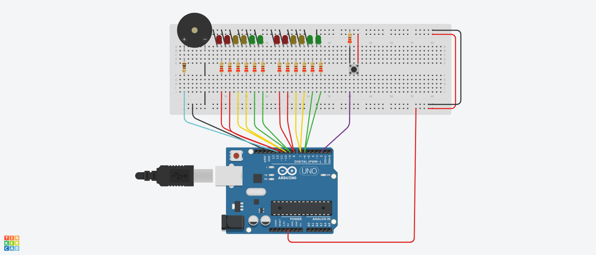

# Dojo N°1 Semaforo Tercera Entrega

## Integrantes 
- Spatola Mateo
- Videla Ribodino Ivan Agustín
- Manzanares Patricio
- Quiroga Joaquin
- Santa Eulalia Matias

## Proyecto: Semaforo.

## Descripción
Este es el código correspondiente al Dojo 1 del Grupo C. En este código se utiliza un Arduino para controlar la iluminación de doce LEDs (Rojo, Amarillo y Verde), un timbre y un pulsador. El objetivo del Dojo fue familiarizarse con la programación en Arduino y la interacción con componentes electrónicos.

Consignas Tercera y Última Entrega - nuevos requisitos:

- Agregar un botón (pull down) que al presionarlo se active la funcionalidad de luz verde con más tiempo, dándole a la persona que lo necesite más tiempo para cruzar la calle , sirve para la próxima luz verde y solo para la próxima luz verde después de presionar el botón. el tiempo se duplicará. 
- Colocar dos semáforos de calles que se crucen  y programarlos para que funcionen en conjunto.

## Función principal
El código hace uso de varias funciones para controlar los LEDs, el timbre y el pulsador. 
Hubo muchas modificaciones del código anterior, ya que ahora son semáforos enfrentados, cuando se prende el rojo, se prende el verde, etc. Además si se presiona el pulsador añade el doble de tiempo a la LED verde para que cruce el peatón.

La función prenderLedConSonidoYLaEnfrentada, se encarga de encender el LED Rojo y la enfrentada a esta y prender y apagar un timbre dos veces por segundo en tono FUERTE, también se encarga de encender el LED Amarillo y su enfrentada y suena una vez por segundo en un tono SUAVE. Y ahora la función prenderApagarLedSinSonido se dividio en dos, una que prende la led prenderLedsSinSonidoYLaEnfrentada y otra que la apaga apagarLedSinSonidoYLaEnfrentada.

~~~ C (lenguaje en el que esta escrito)
void prenderLedConSonidoYLaEnfrentada(int led1, int led2, int tiempoLed, int tiempoSonido, int ruidoBuzzer)
{
  Serial.println("Prendo el led con sonido");
  for(int i = 0; i < tiempoLed; i += 1000)
  {
    if(led1 == LED_ROJO and led2 == LED_VERDE_ENFRENTADO)
    {
      digitalWrite(led1, HIGH);
      digitalWrite(led2,HIGH);
      prenderApagarBuzzer(tiempoSonido, ruidoBuzzer);
      prenderApagarBuzzer(tiempoSonido, ruidoBuzzer);
    }
    else
    {
      if(led1 == LED_AMARILLO)
      {
        digitalWrite(led1, HIGH);
        digitalWrite(led2,HIGH);
      	prenderApagarBuzzer(tiempoSonido, ruidoBuzzer);
      }
    }
  }
}
~~~

~~~ C (lenguaje en el que esta escrito)
void prenderLedsSinSonidoYLaEnfrentada(int led1, int led2, int tiempoLed)
{
  
  Serial.println("Prendo el led sin sonido");
  digitalWrite(led1, HIGH);
  digitalWrite(led2, HIGH);
  delay(tiempoLed);
  
}

void apagarLedSinSonidoYLaEnfrentada(int led1, int led2, int tiempoLed)
{
  Serial.println("Apago el led sin sonido");
  digitalWrite(led1, LOW);
  digitalWrite(led2, LOW);
  delay(tiempoLed);
}
~~~

La función prenderApagarBuzzer hace sonar el timbre una vez en un lapso del tiempo requerido.

~~~ C (lenguaje en el que esta escrito)
void prenderApagarBuzzer(int tiempoSonido, int ruidoBuzzer)
{
  Serial.println("Prendo buzzer");
  tone(BUZZER,ruidoBuzzer);
  delay(tiempoSonido);
  Serial.println("Apago buzzer");
  noTone(BUZZER);
  delay(tiempoSonido);
}
~~~

Función titilarLedColorYLaEnfrentada que titila las veces que haga falta por parametro, cualquier luz y la enfrentada por un tiempo determinado

~~~ C (lenguaje en el que esta escrito)

void titilarLedColorYLaEnfrentada(int led1, int led2, int tiempoLed, int cantidadTitileo)
{
  for(int i = 0; i < cantidadTitileo; i++)
  {
    delay(tiempoLed);
    prenderLedsSinSonidoYLaEnfrentada(led1, led2, tiempoLed);
    apagarLedSinSonidoYLaEnfrentada(led1, led2, tiempoLed);
  }
}
~~~

Se agregó una nueva función activarLuzVerdeConMasTiempoYLaEnfrentada que al presionar el pulsador agrega el doble de tiempo a la LED Verde mientras está prendida 

~~~ C (lenguaje en el que esta escrito)

void activarLuzVerdeConMasTiempoYLaEnfrentada(int tiempoLed)
{
  int pulsadorDown;
  pulsadorDown = digitalRead(PULSADOR_PULL_DOWN);
  if (pulsadorDown == HIGH)
  {
    prenderLedsSinSonidoYLaEnfrentada(LED_VERDE,LED_ROJO_ENFRENTADO,tiempoLed);
  }
  else
  {
    apagarLedSinSonidoYLaEnfrentada(LED_VERDE, LED_ROJO_ENFRENTADO,0);
  }
}

~~~

En el loop principal del código,se enciende la led correspondiente y la enfrentada, luego se apagan y titilan para pasar a la siguiente, asi hasta completar un ciclo y luego se repite indefinidamente.

~~~ C (lenguaje en el que esta escrito)

void loop()
{
  prenderLedConSonidoYLaEnfrentada(LED_ROJO, LED_VERDE_ENFRENTADO,5000,250,500);
  apagarLedSinSonidoYLaEnfrentada(LED_ROJO, LED_VERDE_ENFRENTADO,0);
  titilarLedColorYLaEnfrentada(LED_ROJO, LED_VERDE_ENFRENTADO,250,3);
  prenderLedConSonidoYLaEnfrentada(LED_AMARILLO, LED_AMARILLO_ENFRENTADO,3000,500,100);
  apagarLedSinSonidoYLaEnfrentada(LED_AMARILLO, LED_AMARILLO_ENFRENTADO,0);
  titilarLedColorYLaEnfrentada(LED_AMARILLO, LED_AMARILLO_ENFRENTADO,250,3);
  prenderLedsSinSonidoYLaEnfrentada(LED_VERDE, LED_ROJO_ENFRENTADO, 5000);
  activarLuzVerdeConMasTiempoYLaEnfrentada(5000);
  apagarLedSinSonidoYLaEnfrentada(LED_VERDE, LED_ROJO_ENFRENTADO,0);
  titilarLedColorYLaEnfrentada(LED_VERDE,LED_ROJO_ENFRENTADO,250,3);
  prenderLedConSonidoYLaEnfrentada(LED_AMARILLO,LED_AMARILLO_ENFRENTADO,3000,500,100);
  apagarLedSinSonidoYLaEnfrentada(LED_AMARILLO,LED_AMARILLO_ENFRENTADO,0);
  titilarLedColorYLaEnfrentada(LED_AMARILLO,LED_AMARILLO_ENFRENTADO,250,3);
}
~~~

## :robot: Link al proyecto
- [Proyecto](https://www.tinkercad.com/things/juVcZJ7Y3yz-dojo-numero-uno-3ra-parte-grupo-c-videla-ribodino-div-d)

> Recomendación: Al iniciar simulación bajar volumen
